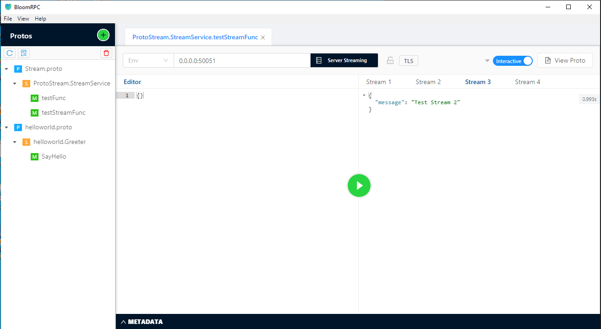

# BASIC [gRPC](https://grpc.io) EXAMPLE

## Server (Python) [Details](https://github.com/okursoftware/gRPC-Example/tree/master/StreamServer)

## Client(Dart - Flutter)[Details](https://github.com/okursoftware/gRPC-Example/tree/master/StreamClient)

### Extra

[gRPC Test App](https://github.com/uw-labs/bloomrpc)

## Meta

Muhammed OKUR – [@linkedin](https://www.linkedin.com/in/muhammed-okur-035b06111/) – muhammedokur@yaani.com

Distributed under the MIT license. See ``LICENSE`` for more information.

[https://github.com/okursoftware](https://github.com/okursoftware/)